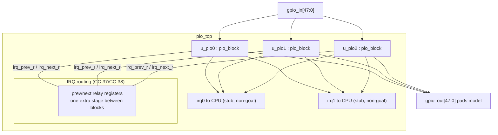
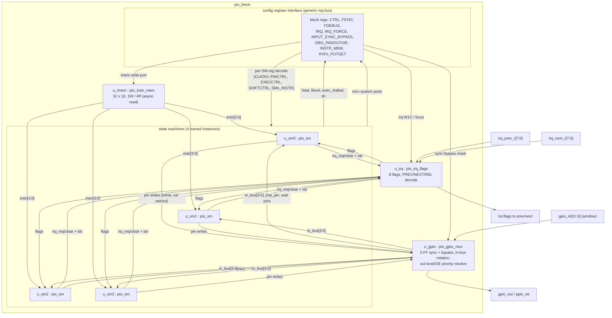

# DESIGN

Design decisions and architecture for the vibe-pio PIO engine model.

**Status: skeleton.** Sections below define the intended structure; content
will be filled in as KANBAN items land. Anything marked *(open)* is a
decision still to be grilled before implementation.

## Goals

1. Functionally faithful model of the RP2350 PIO subsystem:
   - PIO block(s): instruction memory, interrupt/IRQ flags, GPIO mapping.
   - State machines (4 per block): the full instruction set (JMP, WAIT, IN,
     OUT, PUSH, PULL, MOV, IRQ, SET), side-set, delay, autopush/autopull,
     FIFO join, shift counters, exec machinery, input synchronizers.
2. Written in the SystemVerilog subset accepted by both iverilog (`-g2012`)
   and yosys (`read_verilog -sv`): `always_ff`, `always_comb`, packed
   structs/enums only if both tools accept them, no interfaces, no classes.
3. Classic directed testbenches plus SymbiYosys formal properties.
4. Ultimately: symbolic instruction memory, so an SMT solver can solve for
   programs satisfying behavioural assertions.

## Non-goals (initial)

- Cycle-exact transistor-level fidelity (e.g. analog/scratch-pad details).
- Register-block bus (APB/AXI) integration; the model starts at the PIO
  engine level with a generic config/bus interface, refined later.
- FPGA-optimized timing closure; correctness first.

## RTL conventions

Decided:

- Single edge-triggered clock named `clk`; single synchronous, active-high
  reset named `rst` (asserted and released synchronous to `clk`).
- Active-low signals carry the suffix `_n` (e.g. `fifo_empty_n` would be
  avoided — prefer positive `fifo_empty`; `_n` is reserved for genuinely
  active-low interfaces like an external `irq_n`).
- Register module-internal signals carry the suffix `_r` (e.g. `osr_r`,
  `pc_r`). Combinational signals and module ports carry no suffix;
  combinational outputs of `always_comb` may use `_c` if disambiguation
  helps, but default is no suffix.
- SystemVerilog subset: files use `.sv` extension; `logic` everywhere (no
  `reg`/`wire` declarations); `always_ff` for state, `always_comb` for
  logic, no `always @*`/`always @(posedge ...)`.
- Third tool (C17): rtl/*.sv must also stay verilator `--lint-only
  -Wall` clean under exactly four waived idiom classes — PINMISSING /
  PINCONNECTEMPTY (the dangling `dbg_*` readback idiom below),
  UNUSEDPARAM (decode tables kept complete for readability) and
  UNUSEDSIGNAL (interface-complete strobes with documented no-op
  semantics). The waiver list lives in `tools/webbuild.py`'s lint gate;
  width warnings (WIDTHEXPAND/WIDTHTRUNC) are fixed in RTL, never
  waived — the explicit-width convention above is what keeps the third
  tool cheap.
- Non-blocking assignments (`<=`) in `always_ff`, blocking (`=`) in
  `always_comb`; never mix in one block.
- Constants: `localparam`/`parameter` names in UPPER_SNAKE_CASE; widths
  always explicit (e.g. `logic [4:0]`, sized from a localparam like
  `PC_W`), never bare numbers in port/Signal declarations.
- Module and instance naming: modules already prefixed `pio_`; instances
  lowercase `u_`-prefixed (e.g. `u_decoder`).
- Formal-friendliness: every stateful element reset by `rst` (helps
  k-induction); no reliance on X-propagation; memories use synchronous
  read with registered output to keep yosys memory inference clean and
  the symbolic-instruction-memory swap trivial. Sole exception (owner-
  ratified, see Architecture §instruction memory): `pio_instr_mem` uses
  combinational read ports so a write is visible to the very next fetch
  cycle per CC-33; at 32×16 flops this costs nothing in yosys or the
  anyconst swap.

Decided (confirmed by owner):

- The SM clock divider is modeled as `clk`-rate logic producing a
  one-cycle `sm_tick` strobe per SM; all SM state advances only on
  `sm_tick` (side-set/delay counting included). Alternative: a gated
  clock — rejected because gated clocks hurt formal verification.
- FSM states encoded as `localparam` one-hot values with explicit names
  (e.g. `ST_FETCH`, `ST_EXEC`), no inferred state encoding, so formal
  onehotness assertions are meaningful.
- Handshake/stall vocabulary: `stall` (SM stalled this cycle), `fifo_rd`,
  `fifo_wr`, `push`/`pull` — matching datasheet vocabulary where possible
  so assertions read like spec facts.
- LSB/MSB shift directions expressed as a boolean `shift_left` derived
  from config, not duplicated `if` trees.
- One `always_ff` per logical register group (PC+regs, shifters, FIFO)
  rather than one giant block, to keep induction proofs modular.
- No `generate` loops around the 4 SMs — instantiate 4 named instances
  (`u_sm0..u_sm3`) so waveforms and solver traces stay readable.
- Assertions: immediate assertions only — yosys does not support SVA
  `disable iff` in any version, and iverilog's SVA support is thin.
  Reset-guarded checks: `if (!rst) assert(...);` inside `always_ff`;
  combinational invariants in `always_comb`; initial-state exclusions
  via `$initstate`/guarded `$past`.

## Architecture (Phase 2 draft)

Structure mirrors the hardware: the RP2350 has 3 PIO blocks
([SPEC-1-1]), each with its own 32×16 instruction memory shared by its 4
state machines ([SPEC-1-2]) — not one global memory. All SM-architectural
state advances only on `sm_tick`/force-tick (CC-1); all effects register
at the end of the executing tick (CC-3).

### Top-level block diagram

Notes: each block observes a 32-pin window of the 48-line pad model
selected by its `GPIOBASE` ([SPEC-1-4], [SPEC-10-7]). IRQ relaying
between blocks is a registered path at `pio_top` level (CC-38); the CPU
interrupt outputs (`INTR`, INTE/INTF/INTS per [SPEC-7-12]) are exposed as
flat stub ports — interrupt-controller integration is a non-goal.

### pio_block block diagram

### Module descriptions

#### `pio_top`

- **Purpose.** Instantiates the 3 blocks (`u_pio0..u_pio2`), the pad-level
  GPIO banks, and the cross-block IRQ relay.
- **Interfaces.** `clk`/`rst`; `gpio_in` / `gpio_out` / `gpio_oe` pad
  arrays; per-block generic reg-bus ports (see below); `irq0`/`irq1` stub
  outputs to the CPU ([SPEC-7-12]).
- **Spec facts.** 3 identical blocks [SPEC-1-1]; 32-pin windows via
  `GPIOBASE` [SPEC-1-4], [SPEC-10-6]; PREV/NEXT flags visible next cycle
  [SPEC-3-8-8], [SPEC-12-10].
- **Cycle contract.** Owns the CC-38 relay register stage on inter-block
  flag paths. Also the natural home for NEXTPREV_* CTRL fan-out
  ([SPEC-7-5], CC-27/CC-28 lockstep support) — modelled as same-clk-cycle
  application per CC-28's [MODEL] note.
- **Reset/formal.** Relay registers reset to 0; assertions: relay output
  equals the neighbour's flag register delayed by one clk (CC-38); equal
  CLKDIV + simultaneous restart ⇒ identical `sm_tick` history (CC-27).

#### `pio_block`

- **Purpose.** One PIO block: instruction memory, 4 SMs, IRQ flags, GPIO
  mux, and the config register interface (generic — the real bus is a
  non-goal).
- **Interfaces.** Reg-bus slave (flat: `reg_addr`, `reg_wdata`,
  `reg_rdata`, `reg_write`, `reg_read`, one clk-cycle retire); windowed
  `gpio_in`/`gpio_out`/`gpio_oe`; `irq_prev_r`/`irq_next_r` relay buses;
  CPU IRQ stub outputs.
- **Spec facts.** [SPEC-1-2], [SPEC-1-3], register map [SPEC-7-2..13].
- **Cycle contract.** Owns CC-33's write-visibility boundary (reg write
  retiring at end of e observed by fetches from e+1) by construction of
  `pio_instr_mem`; owns CC-30's e/e+1 FIFO-write visibility boundary
  (FIFO system-write port is the reg-bus write into `pio_sm_fifo`,
  retiring at the clk edge).
- **Reset/formal.** Register-file style config: every field reset to its
  datasheet reset value ([SPEC-5-3], [SPEC-7-26] defaults). Assertion:
  any reg write followed by an SM tick ≥ e+1 observes the new value
  (CC-33, CC-30).

  Assembly notes (C10, as built):

  - The INTR composition ([SPEC-7-12]) is exported on `intr[15:0]`
    (flags 15:8, TXNFULL 7:4, RXNEMPTY 3:0); INTE/INTF/INTS stay
    non-goaled stubs. CTRL's RP2350 NEXTPREV_* / PREV-NEXT mask bits
    ([SPEC-7-5]) and GPIOBASE ([SPEC-7-11]) are undecoded here — they
    are pio_top's fan-out/windowing; reads return 0.
  - `pio_sm` grew pure-wiring exports for this card: the four FSTAT
    status bits, the raw SMx_CLKDIV/EXECCTRL/SHIFTCTRL/PINCTRL words
    (RW readback), the gpio-mux window config (IN_BASE/IN_COUNT/
    JMP_PIN — u_regs stays the single owner), and `dbg_force_tick`
    re-exported per SM. pio_block additionally exports `dbg_sm_en` /
    `dbg_sm_pc` / `dbg_force` so the C10 formal invariants are
    port-observable equations (C7/C9 rationale).
  - SMx_EXECCTRL reads overlay EXEC_STALLED on bit 31 ([SPEC-7-15]);
    the stored bit is not readable. FSTAT/FDEBUG/FLEVEL use the RP2350
    nibble layouts ([SPEC-7-29]).

#### `pio_instr_mem`

- **Purpose.** 32 × 16-bit instruction register file, 1 write port
  (reg bus, from `INSTR_MEM0..31` [SPEC-7-10]) / 4 read ports (one per SM).
- **Interfaces.** `wr_addr`/`wr_data`/`wr_en` (clk-rate, from reg decode);
  4 × (`rd_addr[4:0]` in, `rd_data[15:0]` out, combinational read).
- **Spec facts.** 32×16 size [SPEC-1-2], [SPEC-14.1-1]; 1W/4R register
  file serving all SMs "without stalling" [SPEC-1-2], [SPEC-1-5].
- **Cycle contract.** CC-33: no prefetch, no invalidation; a fetch in tick
  T reads the word at the PC against start-of-T state.
- **Deviation from RTL conventions (owner-review item).** Read ports are
  combinational (async-read register file), not synchronous-read. Reason:
  CC-33 requires a write retiring at end of cycle e to be visible to a
  fetch in cycle e+1 *with the SM presenting its PC during that same
  cycle*; a registered read would show the old word one cycle longer and
  would need a write-bypass. Since the array is only 32×16 flops, yosys
  maps it to logic/FFs cleanly, and the symbolic swap (below) is *more*
  trivial with plain flop arrays. Writes remain synchronous.
- **Reset/formal.** Contents reset to a known pattern (all-zero words
  — `jmp 0`-class encodings); the symbolic-program mode is the default-
  off `SYM` parameter (SPEC-16-11, landed C16): set only by the
  synthesis harness's sby script (`chparam -set SYM 1 pio_instr_mem`),
  it swaps the array for one flat `(* anyconst *)` vector with no reset
  and no write port — the real-mode array becomes dead and `prep`
  eliminates its flops — the one owner-ratified exception to the
  all-state-reset convention (cover/BMC only, never k-induction).

#### `pio_sm` (instances `u_sm0..u_sm3`, no generate loop)

- **Purpose.** One state machine: divider, PC, delay, X/Y, decode,
  execute, shifters, FIFOs, EXEC/forced-instruction latch.
- **Interfaces.** From block: `instr[15:0]` (async imem read at `pc_r`),
  `in_bus[31:0]` (rotated+masked input bus), `jmp_pin`, `irq_flags`,
  `irq_prev_r`/`irq_next_r`, per-SM reg-bus decode, `sm_restart`,
  `clkdiv_restart`, force-instr write. To block: pin writes (level/OE,
  side-set/SET/OUT bundles), `irq_req`/`irq_clr` with IdxMode-decoded
  target, FIFO system ports, `pc`/`flevel`/`exec_stalled` readbacks.
- **Spec facts.** [SPEC-1-3], [SPEC-1-5], [SPEC-3.x] semantics, [SPEC-8-x]
  PC/wrap, [SPEC-9-x] stalling.
- **Cycle contract.** Owns the bulk: CC-4 (read-before-write sampling),
  CC-5/CC-6/CC-8 (side-set/pin-write landing), CC-9/CC-10 (shifter and
  PC/delay landing), CC-11..CC-22 (all stall behaviour incl. divider
  keep-running), CC-26..CC-28 (divider), CC-29/CC-31/CC-32 (FIFO timing),
  CC-34..CC-36 (EXEC latch, forced instructions, force-tick collision).
- **Reset/formal.** One `always_ff` per register group (conventions);
  `SM_RESTART` clears only the [SPEC-7-3] subset (not OSR/X/Y/PC — the SDK
  resets PC via a forced JMP, sdk N2); EXEC latch and forced-instr latch
  share one register (CC-34/CC-35). Onehot FSM assertion target.

  Assembly notes (C9, as built):

  - The module is wiring plus two decode details: the FIFO-mode decode
    (SPEC-6-2/6-3 — the aux bits clear/override the FJOIN joins) and
    the tick strobe fanout.
  - The shifter and FIFO datapaths are clock-enabled by
    `sm_tick || force_tick` (CC-1: SM state advances on sm_tick *or*
    the CC-35 force-tick), so a forced PULL/OUT/PUSH/IN moves the
    datapath in its force clk. u_exec qualifies every op port by the
    completing tick, so multi-clk forced stalls never double-shift.
  - `gpio_seen[31:0]` is the required input bus (WAIT GPIO/JMPPIN and
    JMP PIN index it by EXECCTRL.JMP_PIN inside u_exec); the
    single-bit `jmp_pin` of the interface sketch above is subsumed by
    it and pio_gpio_mux's per-SM `jmp_pin` output is a block-level
    convenience.
  - pio_sm exports a `dbg_*` readback bundle (tick strobes, FSM state,
    exec/complete/class strobes, shifter state, autop decision/output
    signals, FIFO mode + raw FJOIN bits). yosys cannot probe instance
    internals from a formal wrapper, so the C9 integration properties
    live on these ports; pio_block leaves them dangling.

##### `pio_sm_decoder`

- **Purpose.** Pure combinational decode of the 16-bit word into fields
  and onehot instruction strobes; includes the class-0x4 overload rule:
  arg2[4]=1 ⇒ FIFO-aux MOV (PUT/GET), arg2≠0 otherwise reserved, else
  PUSH/PULL ([SPEC-14.2-1], [SPEC-2-11..17], [SPEC-3.7-1/2]). Decodes
  bitcount 0 ⇒ 32 [SPEC-2-18]; reserved encodings ([SPEC-13-1]) decoded
  to explicit no-op/assert-illegal outputs.
- **Reset/formal.** Stateless; formal: decode results are a function of
  the word only (assertable as a truth-table check); reserved encodings
  asserted unreachable in constrained programs.

##### `pio_sm_exec`

- **Purpose.** The tick-rate control path: FSM state (onehot
  `ST_FETCH`/`ST_EXEC`/delay/stall), PC update + wrap ([SPEC-8-x], CC-10),
  delay counter, side-set application and OUT/SET/EXEC/MOV execute
  orchestration, X/Y updates, JMP condition evaluation
  ([SPEC-3.1-x], [SPEC-14.5-1]), WAIT/IRQ-wait stall management
  (CC-14..CC-16), EXEC/forced-instruction latch (CC-34..CC-36).
- **Reset/formal.** Everything resets per CC-1/`SM_RESTART` subset;
  onehot assertions; CC-14 stall invariants are the core induction
  targets.

##### `pio_sm_shift`

- **Purpose.** ISR/OSR shift registers and the two saturating 6-bit
  counters ([SPEC-5-1..7]); direction via a single `shift_left` boolean;
  IN rotate/self-shift semantics ([SPEC-3.3-7/8], [SPEC-15-1]);
  autopull/autopush *decision* logic (CC-11..CC-13, evaluated only on
  IN/OUT ticks — [SPEC-3.6-14], [SPEC-5-8/9]).
- **Reset/formal.** Reset: ISR counter ← 0, OSR counter ← 32
  ([SPEC-5-3]); counter-bounds assertions (0..32, saturating).

##### `pio_sm_fifo`

- **Purpose.** Per-SM TX + RX 4-deep FIFOs with join and the RP2350 aux
  modes: `FJOIN_TX`/`FJOIN_RX` 8-deep joins ([SPEC-6-2]) and
  `FJOIN_RX_PUT`/`FJOIN_RX_GET` where RX storage becomes 4
  random-access registers ([SPEC-6-3], [SPEC-3.7-3..7]). Also the
  `FDEBUG` sticky flags ([SPEC-6-7]).
- **Interfaces.** SM side: `push`/`pop`/`level`/`full`/`empty` per
  direction (sampled at start-of-tick per CC-4), plus a *random-access*
  port pair `aux_wr[idx,data]` (PUT) / `aux_rd[idx]` (GET) and a mode
  input (txrx|tx|rx|txput|txget|putget) that redirects the RX storage
  between queue mode and register mode. System side: TX write / RX read
  ports (clk-rate) and `RXFx_PUTGET0..3` access ([SPEC-7-13]). FJOIN-bit
  changes flush contents ([SPEC-6-2]).
- **Why the aux port shape:** the aux modes change the RX storage's
  *addressing* (queue head/tail vs 2-bit index), not its datapath — one
  storage array, a mode-selected address source, is simpler and keeps
  CC-21 (PUT/GET never stall, single tick) a pure routing fact.
- **Reset/formal.** Levels/pointers reset to empty; bounds assertions
  (level ≤ depth, mode-dependent depth 0/4/8, [SPEC-6-1..4]); sticky-flag
  set-condition assertions against CC-19/CC-20/CC-32.

##### `pio_sm_regs`

- **Purpose.** Per-SM config register file — CLKDIV (INT/FRAC),
  EXECCTRL, SHIFTCTRL, PINCTRL ([SPEC-7-14..26]) — plus the clock
  divider (phase accumulator + counter producing `sm_tick`, CC-26) and
  divider restart handling (CC-27).
- **Reset/formal.** All fields reset to datasheet defaults; divider
  reset to phase 0/count 0 with SM disabled until `SM_ENABLE`
  ([SPEC-7-2]); assertion: consecutive `sm_tick` of one SM ≥ INT clk
  cycles apart (CC-25, the divider min-gap contract). Keeping the
  divider here (clk-rate logic) separates it cleanly from tick-rate
  state, which helps induction see the divider as an independent
  free-running counter (CC-28).

#### `pio_irq_flags`

- **Purpose.** The block's 8 IRQ flags: set/clear from 4 SMs, W1C from
  reg bus (`IRQ`), set from `IRQ_FORCE` ([SPEC-7-6]); IdxMode decode
  (this/PREV/REL/NEXT, [SPEC-3.8-4..7], [SPEC-14.3-1]) applied to the
  requesting SM's index before routing.
- **Interfaces.** Per-SM `irq_set/irq_clr` + `flag_idx[2:0]` +
  `idx_mode[1:0]`; bus `irq_w1c`/`irq_force`; `flags[7:0]` readback to
  SMs (for WAIT/JMP/STATUS) and to INTR generation.
- **Cycle contract.** CC-37 (end-of-cycle set/clear, next-cycle
  visibility, no same-cycle sibling relay), CC-39 (simultaneous set+clear
  of one flag ⇒ clear wins, per-bit read-modify-write at one edge).
- **Reset/formal.** Flags reset to 0; no combinational path from any SM's
  request to any SM's flag *read* (assertible — this is the CC-37
  structural guarantee).

#### `pio_gpio_mux`

- **Purpose.** Input path: per-pin 2-FF synchronizers with per-pin bypass
  ([SPEC-10-5], [SPEC-7-7]); per-SM rotated+masked input bus (`in_bus`,
  [SPEC-10-3]) and `jmp_pin` selection. Output path: 32-bit output-level
  and output-enable registers resolving per-pin priority — side-set beats
  OUT/SET within an SM (CC-6), highest-numbered SM wins across SMs (CC-7,
  [SPEC-10-1/2]).
- **Interfaces.** `gpio_in[31:0]` window; per-SM side-set/SET/OUT write
  bundles (base+count+data+we, level and direction); per-SM `in_bus`,
  `jmp_pin`; `sync_bypass` mask; `gpio_out`/`gpio_oe` and DBG_PADOUT/OE
  readback ([SPEC-7-8]); `gpio_seen` (the muxed synchroniser outputs) for
  WAIT GPIO ([SPEC-10-4]); dbg_sticky_* readback of the OUT_STICKY
  records — unlike the sync FFs (flushed by inputs within two cycles)
  the sticky state holds unboundedly, so it is ported out like the DBG
  pads to keep formal properties input/output equations that
  k-induction can close; `pio_block` leaves these dangling.
- **Cycle contract.** CC-23 (2-FF latency / bypass = k+2 / k+1), CC-24
  (sampling at start of tick), CC-5 (OUT_STICKY re-assert — sticky state
  lives here or in exec; placed here so the pin registers have a single
  owner), CC-6/CC-7/CC-8 (write landing and priority).
- **Reset/formal.** Sync FFs and output registers reset to 0;
  assertions: pad@k visible at k+2 (shift-register equivalence), priority
  resolution matches a reference per-pin resolution function.

#### `pio_mon_uart_tx` / `pio_mon_square` (C15 monitors)

- **Purpose.** Spec-conformance monitors over the C11 observables
  (SPEC-16-9): a UART-TX frame checker (run-based timing windows, data
  decode, optional parity, stop) and a square-wave half-period checker.
  Verification IP, not design — placed in `rtl/` because that is the
  one source tree every flow already compiles (sim TBs via the
  Makefile's rtl glob; sby `[files]` sets), which is what lets
  synthesized witnesses be re-checked in sim (C16).
- **Interfaces.** `clk`/`rst` plus the observed pin (`rx`/`sig` =
  `gpio_out[pin]`); status outputs — sticky `err` with class sub-flags
  (`err_timing`/`err_frame`; `err_lo`/`err_hi`), `frame_done`/`edge_t`
  strobes, captured `data`, `frames`/`edges` counters, and `dbg_*`
  readback (state, run length, bit position) so formal properties are
  port-level equations (the pio_sm dbg idiom). No assertions inside:
  wrappers check the exported verdicts — the same instance is the
  spec-eq miter predicate (SPEC-16-10) and a standalone checker
  (`sim/tb_pio_mon.sv`, `formal/pio_mon_fv.sv`).
- **Cycle contract.** Timing windows cite CC-26/CC-25 (divider INT vs
  INT+1 slot lengths); duration measurement cites CC-40 (pin levels
  land on the pad from T+1; registered sampling preserves run lengths).
  Semantics and [MODEL] simplifications: SPEC-16-9.
- **Reset/formal.** One violation latches the class flag and halts the
  monitor until `rst` (bounded-latency, deterministic — usable as a
  formal comparison predicate). `pio_mon_probe_fv` k-inducts the status
  contract; the block-level harnesses run BMC+cover (live-SM induction
  lives in the per-module proofs — the pio_block_fv_b precedent).

### Interface decisions

1. **Instruction memory sharing (CC-33).** Each SM drives its own
   `rd_addr = pc_r` combinationally into `pio_instr_mem` and receives
   `instr[15:0]` combinationally. Fetch = the decode of that word during
   the tick cycle itself; no instruction register in the fetch path (the
   only architectural latch is the EXEC/forced-instruction latch,
   CC-34/CC-35). Because `pc_r` is stable between ticks, there is no
   contention on the 4 read ports, and a reg write at end of e is visible
   to a fetch in e+1 by construction.
2. **FIFO aux modes.** `pio_sm_fifo` exposes the queue interface and the
   `aux_wr/aux_rd[idx]` port pair simultaneously; the mode input (decoded
   from `FJOIN_*` bits) selects which address source drives the RX
   storage and gates the queue pointers. PUSH/PULL decode checks the mode
   and treats PUSH under PUT/GET as undefined-by-spec ([SPEC-3.5-8]) —
   RTL chooses the no-op + sticky-flag-free behaviour and asserts the
   mode constraint in formal instead of implementing undefinedness.
   Autopush is asserted-incompatible with aux modes ([SPEC-3.7-6]).
3. **Config register file.** One flat reg bus per block: `reg_addr[8:0]`,
   `reg_wdata[31:0]`, `reg_rdata[31:0]`, `reg_write`, `reg_read` strobes,
   one-clk retire, no wait states. `pio_block` decodes block-level
   registers locally and forwards per-SM addresses as a per-SM decoded
   subordinate bus (SMx_* subranges). This mirrors the datasheet map
   ([SPEC-7-x]) 1:1 so datasheet addresses stay meaningful, while the
   actual bus protocol (APB/TL-UL) stays a non-goal. *(Width note, C10:
   9 bits — the RP2350 map runs to 0x184; at 8 bits SM3 (0x110+), the
   PUTGET window, GPIOBASE and the IRQ0/1 registers would alias onto
   TXF/INSTR_MEM addresses.)*
4. **IRQ routing.** Within a block: SMs see only the *registered* flags
   (CC-37 structural rule). Between blocks: `pio_top` instantiates relay
   registers — each block receives `irq_prev_r`/`irq_next_r` equal to the
   neighbour's flags delayed one clk (CC-38). To the CPU: per-block
   `INTR` composition into `irq0`/`irq1` stub outputs (INTE/INTF/INTS
   are non-goaled stubs, [SPEC-7-12]).

### Symbolic-friendliness

- **Swap point.** The anyconst swap is confined to `pio_instr_mem`: the
  default-off `SYM` parameter (SPEC-16-11, as landed C16) replaces the
  32 read-port words with one flat `(* anyconst *)` vector — no reset,
  write port deleted — enabled per-run by `chparam`, never by a sim or
  elaboration flow. Because the read ports are already combinational
  flops (no read-enable timing), the surrounding RTL — including all
  four SMs — is untouched by the swap; the real-mode array goes dead
  and is optimized away at `prep` (verified: no `$dff` survives for
  it). Behavioural goals live on the GPIO window (`gpio_out[0]` into a
  C15 monitor, SPEC-16-9) as cover statements; runs are BMC/cover only
  (SPEC-16-3) — with free words the state space is the program space
  and induction has no canonical state. The witness pipeline that
  re-verifies solver output (canonicalization, model replay, generated
  TB, bounded conformance) is SPEC-16-12.
- **Synthesizable-clean rules.** No combinational loops anywhere (the
   flag path is structurally registered — CC-37; the imem read path is a
   plain mux of flops); all state synchronous-reset; the only clk-rate
   vs tick-rate mixing point is inside `pio_sm_regs` (divider) and the
   force-tick OR of CC-36 — both single, well-identified edges.
- **k-induction tractability.**
  - Per-module formal boundaries: each module gets its own `formal/`
    property file bound via `bind`-free instantiation wrappers (yosys
    `assume`/`assert` inline or module-level `f_` bind), so induction
    depth is set by the *module's* state, not the block's.
  - The divider is proven independently (CC-25/CC-26 min-gap and phase
    continuity) and then *assumed* as an interface property in SM proofs
    (`sm_tick` min-gap assumption), decoupling divider induction depth
    (up to 65536) from SM datapath proofs.
  - Full-reset + onehot FSM encodings (conventions) keep the induction
    state space canonical; `pio_instr_mem`'s SYM mode (SPEC-16-11) is the
    one place reset of the imem words is disabled, and its runs are
    BMC/cover only rather than k-induction.
  - CC-3's single-edge effect landing means every architectural property
    is a 2-cycle (pre/post tick) shape — short induction depths.

## Formal strategy

- Per-module safety properties (onehot FSM states, FIFO bounds, shift
  counter bounds) proven with `sby` BMC + k-induction (`prove`).
- A reference behaviour spec (golden model in properties or a reference
  implementation) against which the RTL is proven equivalent — likely via
  a `miter` or assertion-based co-simulation in `formal/`.
- Symbolic program synthesis harness: `pio_instr_mem` contents become free
  (anyconst/anyseq) signals; behavioural constraints (e.g. "SCK toggles
  every cycle", "MISO sampled on rising edge") are asserted on the GPIO
  interface; solver output is a witness PIO program.

## Verification tools

| Tool | Use |
|--------|-----|
| iverilog + vvp | directed/random testbenches (`sim/`) |
| yosys | elaboration & synthesis sanity (`syn` target) |
| sby + SMT solver | BMC, induction, equivalence, synthesis harness (`formal/`) |
| `tools/pio_model` | C12: clk-accurate single-SM golden model of `pio_block` (SM0 live per SPEC-16-4), native .pio assembler + disassembler, and the model-vs-RTL trace differential (`make model`): the model consumes the same pio-stim schedules as `sim/tb_trace_dump.sv` and both emit SPEC-16-7 traces that the differ compares under the SPEC-16-2 exclusions. Gates: assembler bit-equality with pioasm on every `conf_pioexamples.svh` program, the 20-program conformance matrix, randomized fuzzing, and a mutation demo (injected model bugs must be caught red, green unmutated). |
| `tools/hyperequiv.py` | C13 equivalence oracle (`make equiv`): program pair + horizon -> C12-model pre-filter, generated C11 miter instance, sby bmc verdict, decoded + replay-verified counterexample reports. Since C14 the miter takes per-side `SM0_EXECCTRL_A/B` (SPEC-16-8) so the oracle certifies EXECCTRL-overlay (wrap-rewritten) pairs, with the pair's differing bits masked out of the readback compare. |
| `tools/hyperopt.py` | C14 hyperoptimizer (`make hyperopt`): a catalog of semantics-preserving rewrites (trace-eq vs spec-only tagged, SPEC-/CC-cited) searched to a peephole closure, screened by the C12 model under the seed schedule and the C13 pre-filter under the miter config, Pareto-filtered on (imem words, ticks per loop iteration) and certified through the oracle; spec-only speed rewrites and the PINCTRL/SHIFTCTRL-overlay entries (side-set fusion, autopull) are catalogued and regression-cased but reported uncertified — the C15 spec-eq predicate exists (SPEC-16-10), wiring the oracle to it is future work. |
| `rtl/pio_mon_*.sv` | C15 spec-conformance monitors (SPEC-16-9): UART-TX frame and square-wave half-period checkers over the gpio_out observables, shared by `sim/tb_pio_mon.sv` (standalone, reference programs accepted / corrupted rejected) and `formal/pio_mon.sby` (standalone BMC+cover, the spec-eq twin `pio_mon_spec_eq_fv` — monitors as the miter comparison predicate, SPEC-16-10 — and a k-induction probe of the monitors' status contract). C16 reuses the same instances as synthesis cover goals and witness re-checks (SPEC-16-11/12). |
| `formal/pio_synth_fv.sv` + `tools/hypersynth.py` | C16 symbolic-program synthesis (`make synth`): free imem words (`pio_instr_mem` SYM via chparam, SPEC-16-11) with the C15 monitors as cover goals — square-wave smoke and UART-TX-byte targets — plus the witness pipeline (SPEC-16-12): cover-trace extraction, canonicalization (nop-fills, delay-preserving nops for reserved parks), `.pio` disassembly, and the three re-verify legs (C12 model replay + SPEC-16-9 window check, generated iverilog TB, bounded formal conformance of the loaded witness); the red contradictory-spec case proves the cover goals genuinely bind the solver (UNSAT). |
| `tools/webbuild.py` + `web/` | C17 wasm backend (`make web`): the verilator `-Wall` lint gate over rtl/*.sv (four documented idiom waivers), the AOT wasm build — Verilator `--cc --assert` over `web/pio_shim_top.sv` (pio_block + the compiled-in invariant subset) linked by em++ into one modularized `build/web/pio_engine.js` — and the three-way SPEC-16-7 trace gate (model ↔ iverilog ↔ verilator-wasm over the C12 conformance matrix + fuzz corpus). `web/pio_shim.cpp` is the C++ cycle engine: the gate face (`pio_stim_trace`, pio-stim replay → trace) and the game face (`pio_reg_write`/`pio_reg_read`/`pio_step`/`pio_snapshot` — the C18 client API). Two mutation demos keep it honest: the sample-late shim defect (trace diff) and the stale imem-shadow defect (compiled-in asserts abort the wasm run). |

### Golden model (C12, as built)

- The model (`tools/pio_model/model.py`) is a cycle-by-cycle
  transcription of the RTL — every section cites the rtl/ file and the
  SPEC-/CC- facts the RTL cites — with combinational-then-edge update
  discipline (CC-3/CC-4). Its contract is trace equality with the RTL
  on the SPEC-16-7 observables, not independent re-derivation: where
  the RTL made a modelling choice ([MODEL] clauses), the model inherits
  it.
- Differential runs drive both sides from one pio-stim v1 memory image
  ($readmemh; `tools/pio_model/stim.py` generates, `sim/tb_trace_dump.sv`
  replays). The TB drives inputs at the negedge (mid-cycle) so nothing
  races the DUT's posedge evaluation — the tb_conf bus_wr idiom, made
  mandatory here after the posedge-drive variant silently dropped bus
  writes.
- Two transcription bugs the differ caught during bring-up (both now
  model-fixed and regression-covered by the committed schedules):
  the FIFO mode sampler must register the *pre-edge* mode (a FJOIN
  write flushes the cycle after it retires, dropping any TXF write
  coincident with the flush edge, SPEC-6-2), and the bus-decoded
  PUTGET index is a separate signal from the executing instruction's
  aux index (SPEC-7-13 vs SPEC-3.7-4).
- Multi-SM runs, TXF1..3 writes and SM1..3 window accesses are out of
  the v1 scope and rejected by the model (the harness never issues
  them; single-SM equivalence is the SPEC-16-4 scoping).

### Web backend (C17, as built)

- The browser runs the verified RTL itself: Verilator `--cc --assert`
  elaborates `web/pio_shim_top.sv` (pio_block plus the compiled-in
  invariant subset) and em++ AOT-links the Verilated model into one
  modularized wasm engine, `build/web/pio_engine.js` — Verilator itself
  is not shipped into the browser. One build serves both faces of
  `web/pio_shim.cpp`'s cycle engine: the gate face (`pio_stim_trace` —
  pio-stim v1 replay emitting the SPEC-16-7 trace, run headless under
  node by `web/node_gate.js`) and the game face
  (`pio_engine_reset`/`pio_reg_write`/`pio_reg_read`/`pio_step`/
  `pio_snapshot` — load program + config overlay, tick, pin in, state
  out; the C18 client API). The timeline contract mirrors
  `sim/tb_trace_dump.sv` exactly: CC-1 reset, mid-cycle input drive,
  negedge-point observable sampling, posedge retire.
- pio_model stays the CI cross-check oracle: `make web`'s three-way
  gate runs the C12 conformance matrix + fuzz corpus through all three
  backends and requires line-identical SPEC-16-7 traces (under the
  SPEC-16-2 exclusions) model ↔ iverilog ↔ verilator-wasm.
- The invariant subset compiled into the shipped build (immediate
  assertions, the owner convention — the SVA dialect of `formal/` never
  elaborates under Verilator): i1 CC-33 imem fetch-word coherence (the
  fv_a a1 shadow, asserted unconditionally on the free-running
  SMx_INSTR readback mux), i2 SPEC-7-2 SM_ENABLE storage shadow, i3
  the output-visible reset contract (gpio_out/oe 0, intr 16'h00f0).
  Two red-injection macros prove the self-checks fire:
  PIO_DEFECT_SAMPLE_LATE (shim samples post-edge — caught by the trace
  diff) and PIO_DEFECT_INVARIANT (stale shadow, DUT untouched — caught
  only by the compiled-in assertion, which aborts the wasm run).
- Known wasm-port wrinkles, for whoever touches the build next:
  verilatedos.h needs `-DVL_IGNORE_UNKNOWN_ARCH` (no wasm branch for
  VL_CPU_RELAX); verilated.mk hardcodes `LINK=g++` and appends
  `-lpthread -latomic` (wasm-ld has neither), so the objects are built
  via the generated makefile with `CXX=em++` and the final link is
  webbuild's own em++ invocation; verilator does not `mkdir -p` a
  nested `--Mdir`.

## Key reference

- RP2350 datasheet, §PIO (programmable I/O). Facts to be transcribed into
  `docs/` as they become load-bearing (instruction encoding, FIFO depths,
  interrupt semantics, clock divider behaviour, differences from RP2040).
